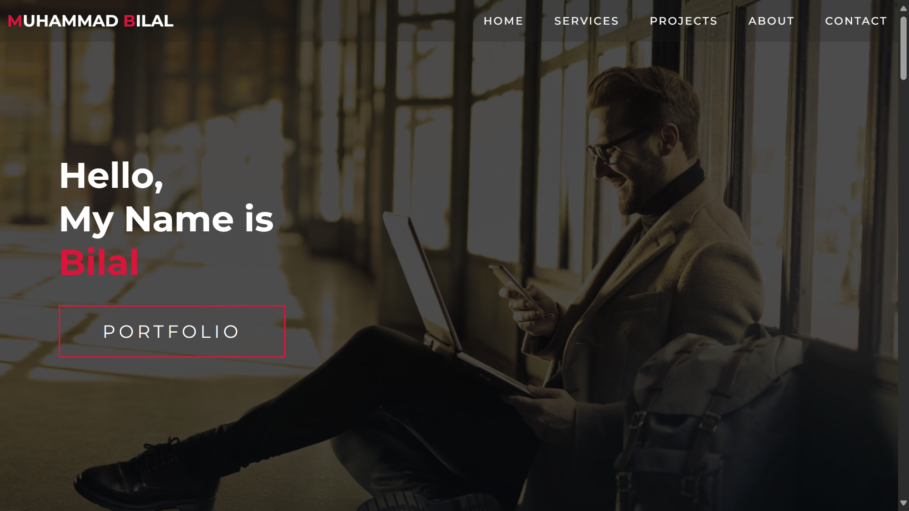
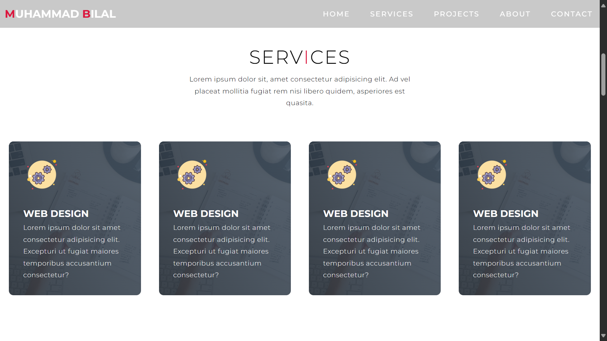
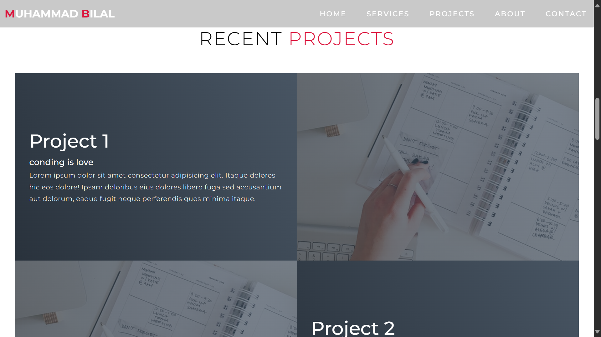
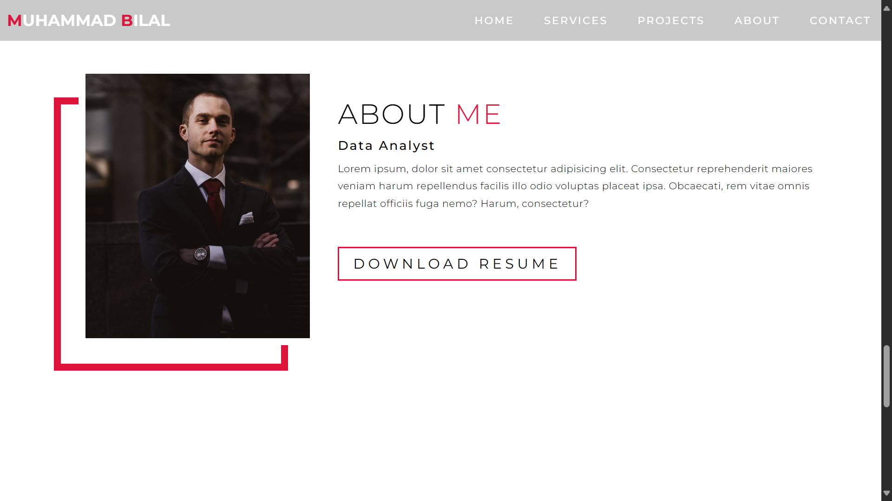
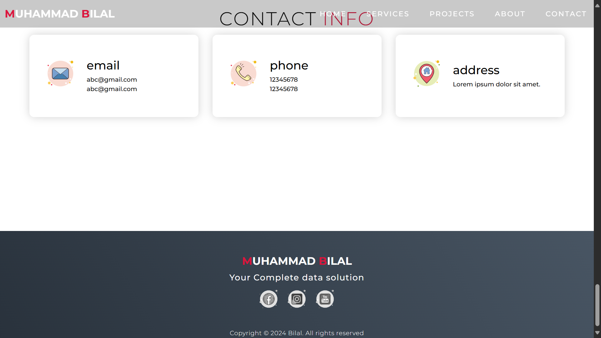
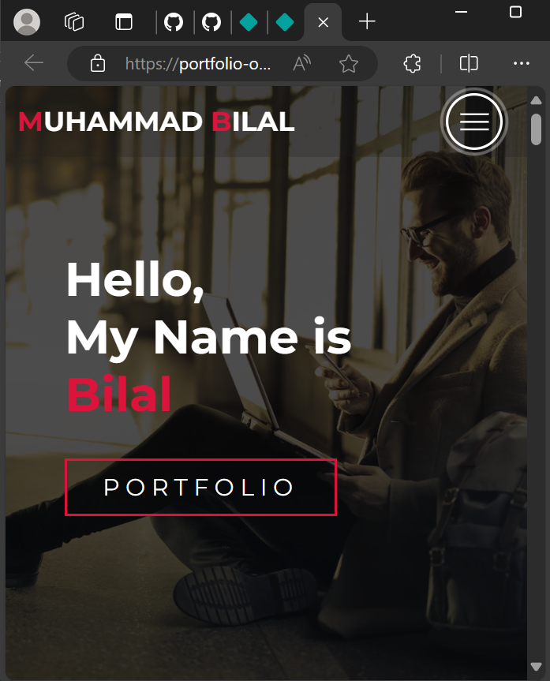
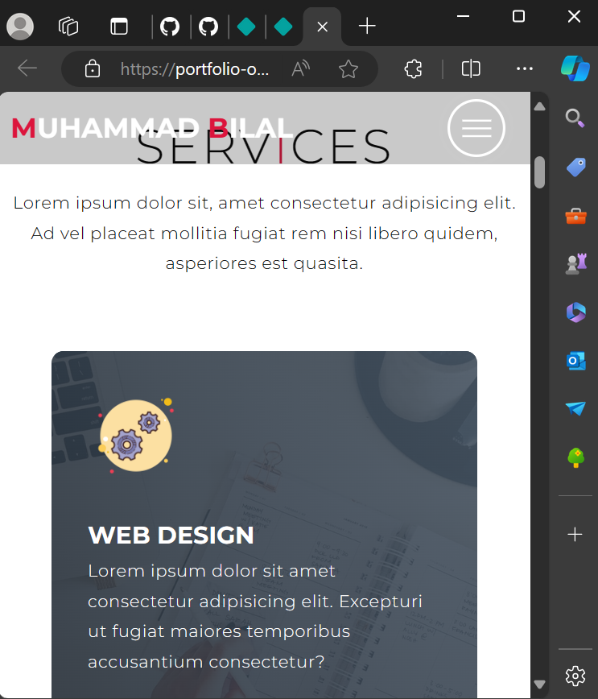

# Portfolio-One-Page

## Overview
This is a simple one-page portfolio website designed to highlight work, skills, and contact information. The project is hosted on Netlify.

## Technologies
The website is built with the following technologies:
- **HTML**: Structure and content
- **CSS**: Styling and layout
- **JavaScript**: Interactivity

## Project URL
You can view the live version of the portfolio here: [Portfolio One Page](https://portfolio-one-page.netlify.app/).

## Project Screenshots
Here are some screenshots of the website:

## How to Use
If you'd like to run the project locally or contribute to it, follow these steps:

1. Clone the repository: git clone https://github.com/Bilal00404/Portfolio-One-Page.git
2. Navigate to the project directory: cd Portfolio-One-Page
3. Open the project in a browser or use a local development server to view it.

## Contact
If you have any questions or suggestions, feel free to contact me at bilalchanna67@gmail.com.
